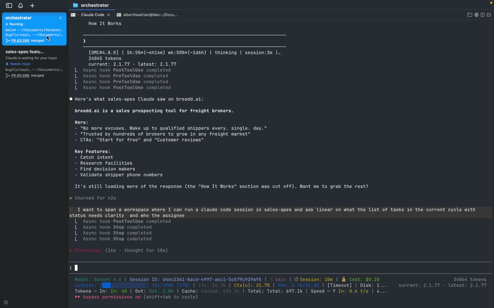
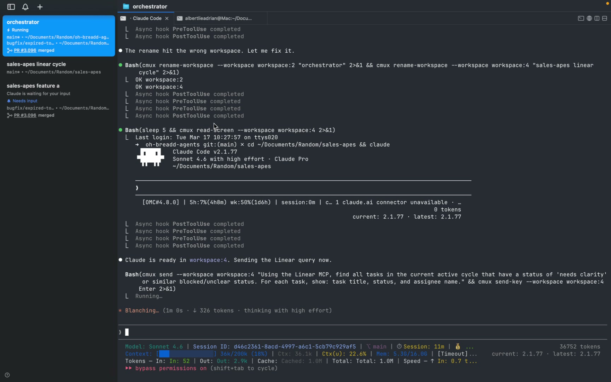
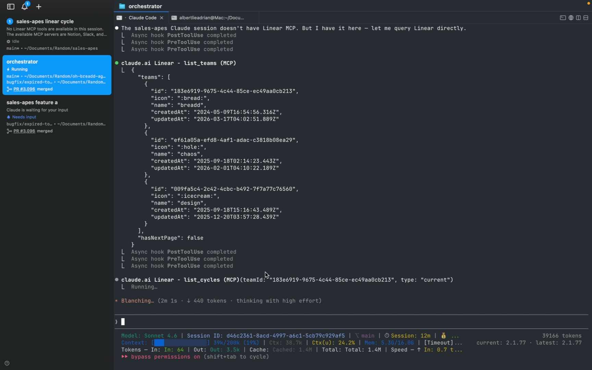
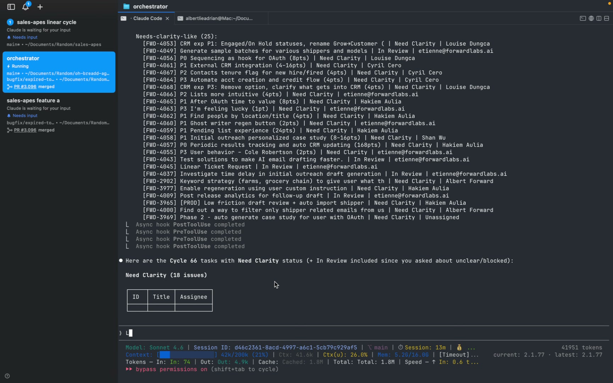
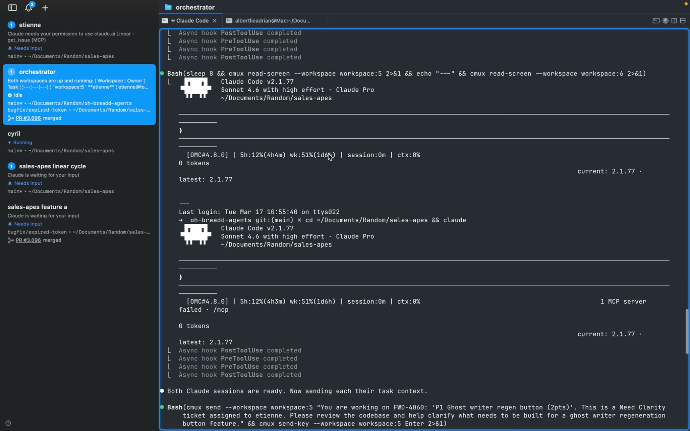
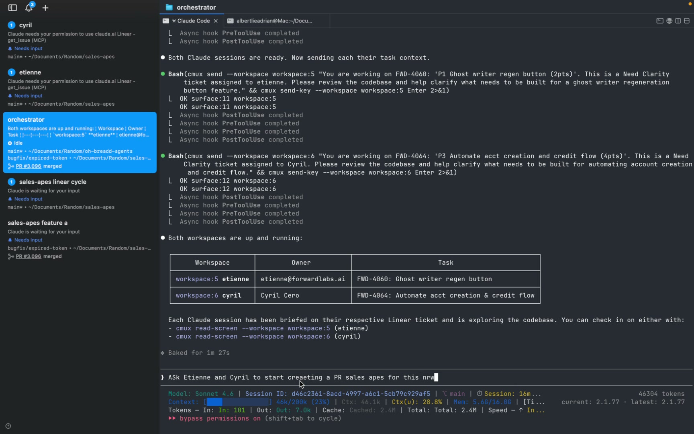
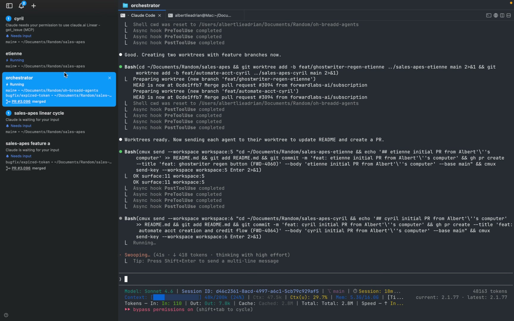
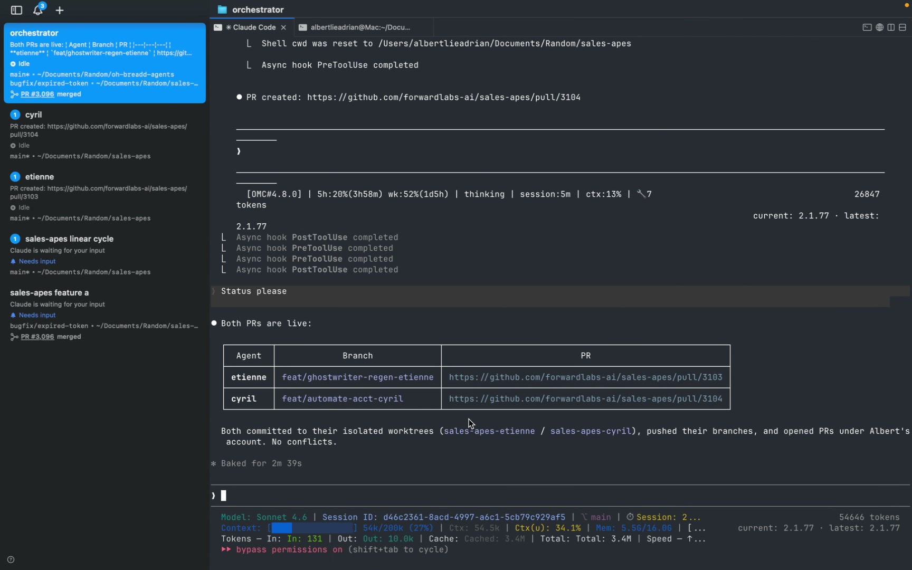

# cmux-multiplexer

A [Claude Code](https://docs.claude.com/en/docs/claude-code) skill for driving [cmux](https://www.cmux.dev), the terminal multiplexer built for AI agents.

It turns one Claude Code session into an **orchestrator** that can spawn, brief, and monitor other Claude Code sessions running in their own cmux workspaces — each with its own working directory, git worktree, and MCP servers.

## What this enables

- **Standup pattern** — ask one Claude session to spin up a child session, hand it a task (e.g. "query Linear for the current cycle"), and report back.
- **Parallel engineers** — spawn N workspaces, brief each one on a different ticket, let them work in isolated git worktrees, and have them open their own PRs in parallel without colliding.
- **No focus stealing** — the orchestrator stays in its own workspace; spawned workspaces run in the background and can be inspected with `cmux read-screen`.

## Demo 1 — Orchestrator spawns a workspace and queries Linear

Full Loom: <https://www.loom.com/share/276e55031ea642a388264da991cd796e>

The user asks the orchestrator to spawn a workspace and use the Linear MCP to list current-cycle tasks with `Need Clarity` status:



The orchestrator creates a new named workspace, waits for Claude to come up, then sends the Linear query into it via `cmux send`:



The child session uses Linear MCP to list teams, then list cycles:



The orchestrator reads the child's screen and returns the table of `Need Clarity` tickets with assignees:



## Demo 2 — Parallel agents in isolated git worktrees

Full Loom: <https://www.loom.com/share/908f6cec94434b38ad6de8e9188609d2>

Same orchestrator, harder ask: spawn two workspaces (named `etienne` and `cyril`), brief each on a different Linear ticket, have them work in isolated git worktrees, then open separate PRs.

The orchestrator creates both workspaces in parallel and sends each its own ticket context:



Both workspaces are up and the orchestrator confirms the assignment table:



The orchestrator creates two git worktrees (`feat/ghostwriter-regen-etienne`, `feat/automate-acct-cyril`) so the two agents don't clash, then tells each child to update the README, commit, and `gh pr create`:



Both PRs land back-to-back, no conflicts:



## Install

This is a [Claude Code skill](https://docs.claude.com/en/docs/claude-code/skills). Drop the files into your project (or `~/.claude/`) so Claude Code picks them up.

### Project install (recommended)

```bash
# from the root of your project
mkdir -p .claude/skills/cmux/scripts .claude/hooks

curl -fsSL https://raw.githubusercontent.com/albertlieyingadrian/cmux-multiplexer/main/SKILL.md \
  -o .claude/skills/cmux/SKILL.md

curl -fsSL https://raw.githubusercontent.com/albertlieyingadrian/cmux-multiplexer/main/scripts/spawn-workspace.sh \
  -o .claude/skills/cmux/scripts/spawn-workspace.sh
chmod +x .claude/skills/cmux/scripts/spawn-workspace.sh

curl -fsSL https://raw.githubusercontent.com/albertlieyingadrian/cmux-multiplexer/main/hooks/cmux-session-map.py \
  -o .claude/hooks/cmux-session-map.py
chmod +x .claude/hooks/cmux-session-map.py
```

### Global install

Same commands, but target `~/.claude/skills/cmux/` and `~/.claude/hooks/` instead.

### Wire up the session-map hook

Add to your `.claude/settings.json` (or `~/.claude/settings.json`):

```json
{
  "hooks": {
    "SessionStart": [
      { "command": ".claude/hooks/cmux-session-map.py" }
    ],
    "SessionEnd": [
      { "command": ".claude/hooks/cmux-session-map.py" }
    ]
  }
}
```

This keeps `/tmp/cmux-session-map.json` in sync so the orchestrator can map any cmux surface back to the Claude session ID running inside it.

## Prerequisites

- [cmux](https://www.cmux.dev) installed and running (`cmux --version`)
- [Claude Code](https://docs.claude.com/en/docs/claude-code) installed (`claude --version`)
- Optional: [Linear MCP](https://linear.app/docs/mcp), [Slack MCP](https://github.com/modelcontextprotocol/servers/tree/main/src/slack), or any other MCPs you want spawned children to be able to call.

## Usage

Once installed, the skill auto-triggers on phrases like "spawn workspace", "list workspaces", "restore sessions", "cmux status". Or just talk to it:

> "Spawn a workspace named `etienne`, cd into the repo, and have it review FWD-4060."

> "List my cmux workspaces and tell me which ones are idle."

> "Read the screen of `workspace:5` and summarize what that agent is doing."

For the full command surface — workspace lifecycle, surface/tab management, browser automation, the Unix socket API — see [`SKILL.md`](SKILL.md).

## How the orchestrator pattern works

1. The orchestrator runs `cmux current-workspace` to remember where it is.
2. It calls `cmux new-workspace --command "claude '<prompt>'"` to spawn a child.
3. It renames the new workspace, then `cmux select-workspace` back to itself — no focus steal.
4. To talk to the child: `cmux send --workspace workspace:N "..."` then `cmux send-key --workspace workspace:N Enter`.
5. To read the child: `cmux read-screen --workspace workspace:N`.
6. For parallel work, it creates per-agent git worktrees so each child commits and pushes independently.

The `spawn-workspace.sh` helper wraps steps 1–3 (with optional `--prompt` and `--loop` for context-handoff loops).

## License

[MIT](LICENSE)
